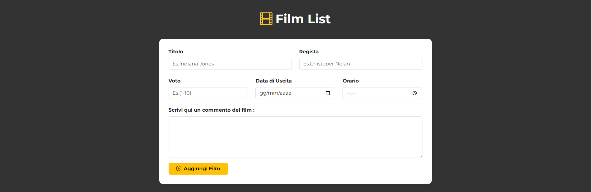
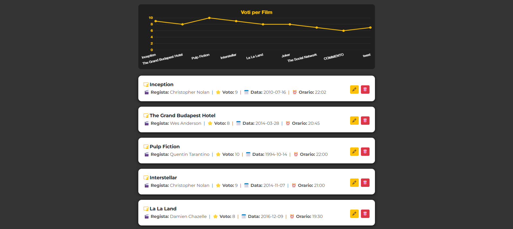
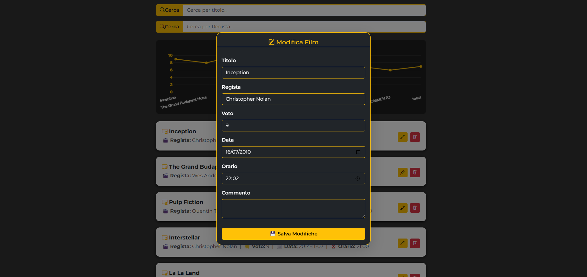
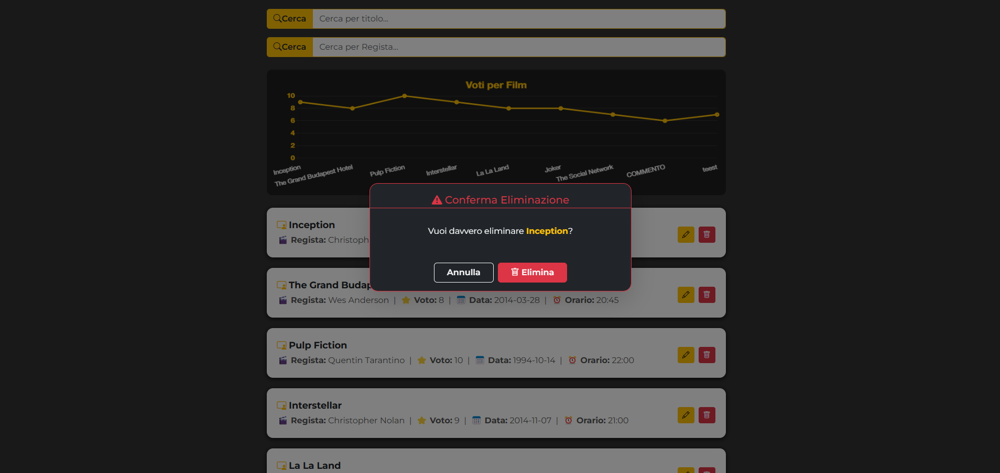

# CRUD API Application – Gestione Film

## Descrizione del progetto

[](https://github.com/tuo-username/tuo-repo)

Questa applicazione web consente di gestire dinamicamente una raccolta di film sfruttando le API. L’utente può inserire nuovi film tramite un modulo dedicato, e ogni scheda viene generata automaticamente. Ogni film può essere successivamente modificato, eliminato o arricchito con un commento personalizzato.

È presente una sezione di ricerca che permette di filtrare i film in base al **titolo** o al **regista**, facilitando la consultazione del catalogo.

Inoltre, in base ai voti assegnati durante la creazione delle schede, viene generato un grafico interattivo che mette in relazione i film in base al punteggio ricevuto, offrendo una panoramica visiva della valutazione complessiva.


*Novembre 2025*
🧑‍💻

---










🔨
| Nome | Linguaggio     | Versione |
|------|----------------|----------|
| HTML | Markup         | 5        |
| CSS  | Style Sheet    | 3        |
| JS   | Logic          | es7      |
| Node | Backend        | 22.20    |


👨‍💻
```bash
cd ./FILMS
npm install
npm run start
Avviare Golive da VS-Code
